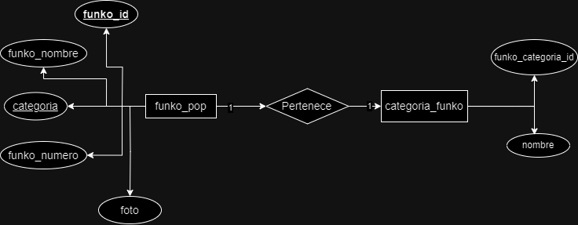
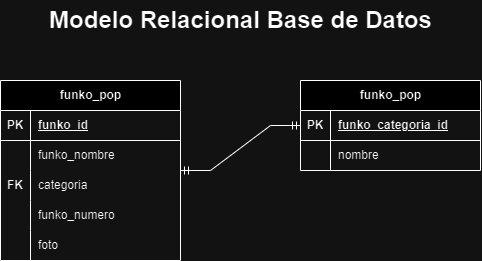

# FUNKO POP

## Listado de Entidade

### funko_pop **(ED)**

- funko_id **(PK)**
- funko_nombre
- categoria **(FK)**
- funko_numero
- foto 

### categoria_funko **(EC)**

- funko_categoria_id **(PK)**
- nombre

## Relaciones

1. Un **funko_pop** _pertenece_ a un **categoria_funko** (_1 a 1_).

## Diagramas

### Modelo Entidad - Relación

### Modelo Relacional de la Base de Datos

## Reglas del Negocio

### funko_pop

1. Crear el resgistro de un funko pop.
1. Leer el registro de uno(s) funko_pop(s) dada una condicion en particular.
1. Leer los registros de la entidad entera.
1. Actualizar los datos de un funko_pop dada una condición en particular.
1. Eliminar el registro de un funko_pop dada una codición en particular.

### categoria_funko

1. Crear el resgistro de una categoria funko pop.
1. Leer el registro de una(s) categorias_funko_pop(s) dada una condicion en particular.
1. Leer los registros de la entidad entera.
1. Actualizar los datos de una categoria_funko_pop dada una condición en particular.
1. Eliminar el registro de una categoria_funko_pop dada una codición en particular.