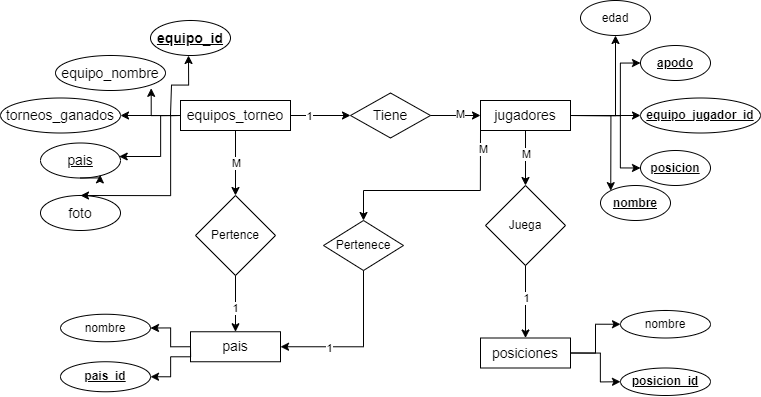

# Diseño de Base de datos "_Torneo Voleibol_"

## Listado de entidades

### equipos_torneo **(ED)**

- equipo_id **(PK and FK)**
- equipo_nombre 
- torneos_ganados
- pais **(FK)**
- foto

### jugadores **(ED)**

- equipo_jugador_id **(PK)**
- apodo **(PK)**
- nombre **(PK)**
- edad 
- posicion **(FK)**
- pais **(FK)**

### posiciones **(EC)**

- posicion_id **(PK)**
- nombre

### pais **(EC)**

- pais_id **(PK)**
- nombre

## Relaciones

1. Un **equipos_torneo** tiene varios **jugadores** (_1 a M_).
1. Un **jugadores** juega en una **posicion** (_M a 1_).
1. Un **jugadores** pertenece a un **pais** (_M a 1_).
1. Un **equipos_torneo** pertenece a un **pais** (_M a 1_).

## Diagramas

### Modelo Entidad-Relacion Voleibol

### Modelo Relacional de la Base de Datos

## Reglas del negocio

### Equipos Volebol

1. Crear el registro de un nuevo equipo de voleibol.
1. Leer el registro de un(os) equipo(s) de voleibol dada una condición.
1. Leer todos los registros de la entidad **(_equipos-voleibol_)**
1. Actualizar los datos de un equipo mediante una condicíon en particular.
1. Eliminar los datos de un equipo de voleibol dada una condicíon en particular.

### Jugadores

1. Crear el registro de un nuevo **_jugador_**.
1. Leer el registro de un(os) jugador(es) de voleibol dada una condición.
1. Leer todos los registros de la entidad **(_jugadores_)**
1. Actualizar los datos de un jugador mediante una condicíon en particular.
1. Eliminar los datos de un jugador dada una condicíon en particular.

### posiciones

1. Crear el registro de una nueva **_posicion_**.
1. Leer el registro de una posicion posicion dada una condicion en particular.
1. Leer todos los registro de la entidad **(_posiciones_)**
1. Actualizar el registro de una posicion dada una condicion en particular.
1. Eliminar el registro de una posicion posicion dada una condicion en particular.

### pais

1. Crear el registro de un nuevo **pais**.
1. Leer el registro de un pais dada una condicion en particular.
1. Leer todos los registro de la entidad **(_pais_)**
1. Actualizar el registro de un pais dada una condicion en particular.
1. Eliminar el registro de un pais posicion dada una condicion en particular.